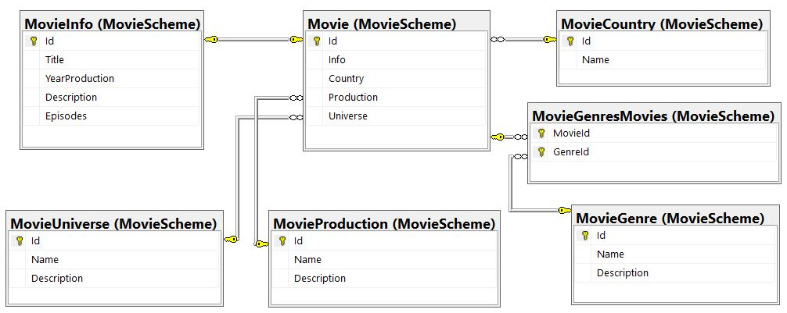
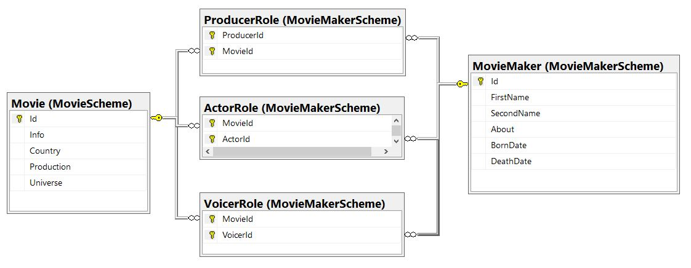
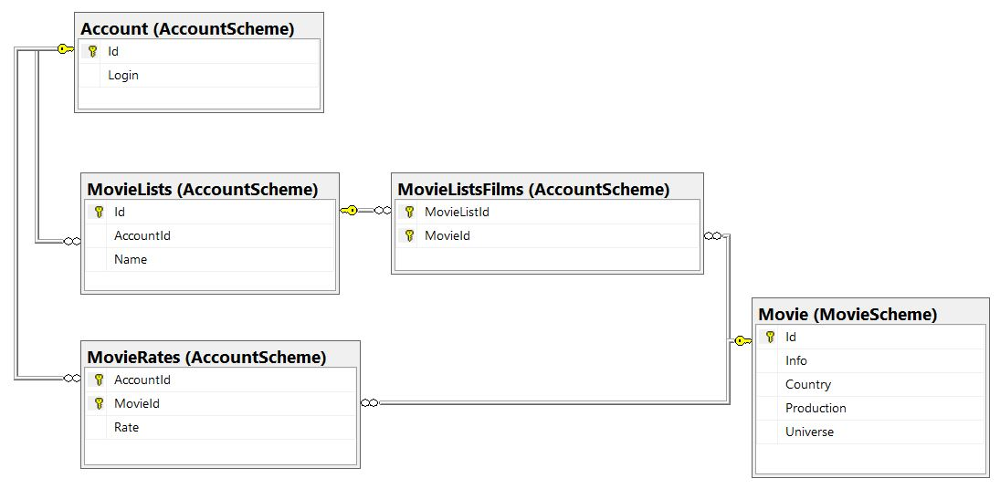

This project is a simple database for storing information about a movie service.

Current database contains 15 tables, let's split them into 3 logical groups and consider them separately.

The first logical group is the Movie group. This group contains tables that contains movie information.

1. MovieCountry - a table that contains information about the country where the movie was created.
2. MovieProduction - a table that contains information about which type of movie is for example film, seral, cartoon, etc.
3. MovieUniverse - a table that contains information about movie series.
4. MovieGenre - a table that contains information about movie genres.
5. MovieGenresMovies - table that link Movie table and MovieGenre table, that has n-to-n connection.
6. MovieInfo - a table that contains general information about movie like title, description, etc.
7. Movie - a table that connects all the table above.

The second logical group is the Movie Maker group. This group contains tables that contains information about actors, producers, etc and links it with movie.

1. MovieMaker - a table that contains information about persons that takes part in the creation of movies.
2. ActorRole - a table that links Movie with MovieMaker, that has n-to-n connection. This table means that Movie Maker is actor of the movie.
3. ProducerRole - a table that links Movie with MovieMaker, that has n-to-n connection. This table means that Movie Maker is producer of the movie.
4. VoicerRole - a table that links Movie with MovieMaker, that has n-to-n connection. This table means that Movie Maker is voicer of the movie.

Last logical group is the Account group. This group contains tables that contains account-related information.

1. Account - a table that contains information about the user's account.
2. MovieLists - a table that contains information about users movie lists.
3. MovieListsFilms - a table that contains information about movies in each of the movie lists.
4. MovieRates - a table that contains information about users rates for movies.

Current repository contains 4 queries:
1. DbInitialization.sql - is used to create database and every table.
2. DbCreationProcedures.sql - contains procedures, which is used to insert data into the tables.
3. DbSetInitialData.sql - is used to add initial data into the database. The query is using procedures from DbCreationProcedures.sql.
4. DbSelectQuery.sql - contains views and procedures, with select queries.